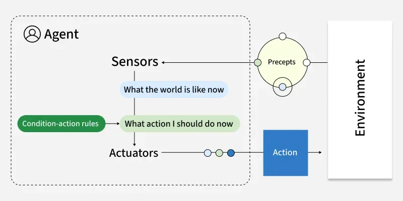
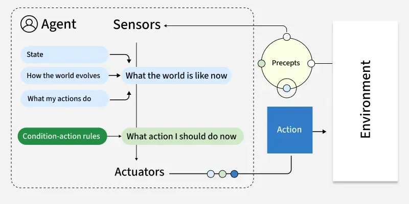
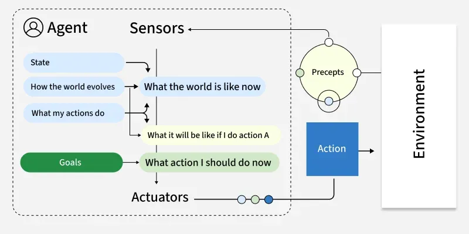
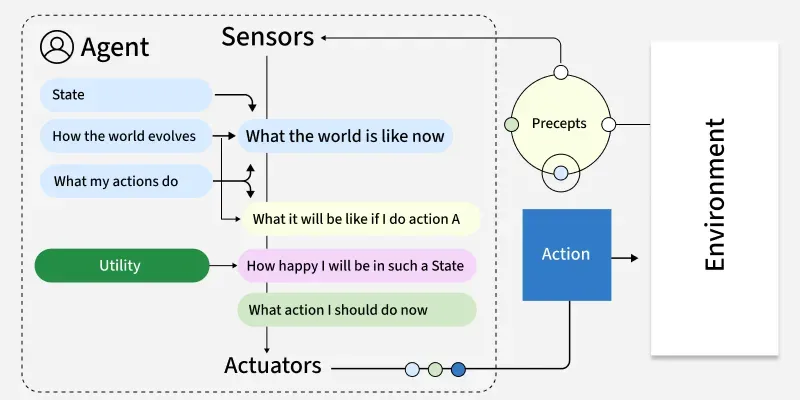
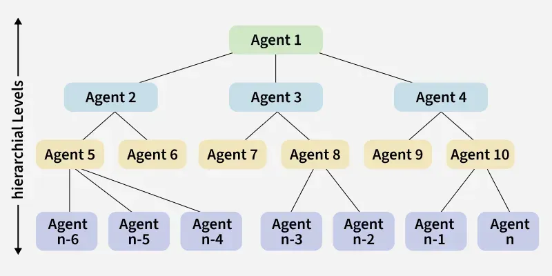

# 🤖 What is AI Agent?

- A software program that can interact with its environment, collect data and use that data to perform self-directed tasks that meet predetermined goals. Humans set goals, but an AI agent independently chooses the best actions it needs to perform to achieve those goals.

- An agent is a system designed to perceive its environment, make decisions and take actions to achieve specific goals. Agents operate autonomously, without direct human control and can be classified based on their behavior, environment and number of interacting agents.

-For example, consider a customer support AI agent that wants to resolve customer queries. 
 The agent will automatically ask the customer different questions >> look up information in internal documents >> respond with a solution >> Based on the customer responses, it determines if it can resolve the query itself or pass it on to a human.

# 🆚 Normal AI vs Agentic AI

| Feature  | Normal AI (like ChatGPT)     | Agentic AI                       |
| -------- | ---------------------------- | -------------------------------- |
| Behavior | Responds                     | Acts                             |
| Memory   | Limited                      | Persistent                       |
| Workflow | Single step                  | Multi-step                       |
| Tools    | Optional                     | Uses APIs, systems               |
| Example  | Answers a Terraform question | Writes, tests, deploys Terraform |

# Key Features of AI Agents
1. Autonomous: Act without constant human input and decide next steps from past data like a bookstore bot flags missing invoices.

2. Goal‑driven: Optimize for defined objectives like a logistics AI balancing speed, cost and fuel use.

3. Perceptive: Gather info from sensors, inputs or APIs like a cybersecurity agent tracking new threats.

4. Adaptable: Adjust strategies when situations change.

5. Collaborative: Work with humans or other agents toward shared goals like healthcare agents coordinating with patients and doctor.

# How do AI Agents Work?

1. Persona: 
- Each agent is given a clearly defined role, personality and communication style along with specific instructions and descriptions of the tools it can use. 
- A well‑crafted persona ensures the agent behaves consistently and appropriately for its role, while also evolving as it gains experience and engages with users or other systems.

2. Memory:
- Memory enables an agent to keep context, learn from experience and adapt its behaviour over time.
- Agents typically have multiple types of memory :
  - Short-term memory for the current interaction.
  - Long‑term memory for storing historical data and conversations.
  - Episodic memory for recalling specific past events
  - Consensus memory for sharing knowledge among multiple agents

3. Tools: 
- These are functions or external resources the agent can use to access information, process data, control devices or connect with other systems. 
- Tools may involve physical interfaces, graphical UIs or programmatic APIs. 
- Agents also learn how and when to use these tools effectively, based on their capabilities and context.

4. Model: 
- Agents use large language model (LLM) which serves as the agent’s “brain”. 
- The LLM interprets instructions, reasons about solutions, generates language and orchestrates other components including memory retrieval and tools to use to carry out tasks.

# AI Agent Classification

1. Reactive Agents: Respond to immediate environmental stimuli without foresight or planning.

2. Proactive Agents: Anticipate future states and plan actions to achieve long-term goals.

3. Single-Agent Systems: One agent solves a problem independently.

4. Multi-Agent Systems: Multiple agents interact, coordinate or compete to achieve goals; may be homogeneous (similar roles) or heterogeneous (diverse roles).

5. Rational Agents: Choose actions to maximize expected outcomes using both current and historical information.

# Types of Agents

1. Simple Reflex Agents :
=========================

- Act based solely on current perceptions using condition-action rules. These agents respond directly to stimuli without considering past experiences or potential future states. 

- They operate on basic "if-then" logic: if a specific condition is detected, execute a corresponding action.

- Key features:
  - No memory of past states
  - No model of how the world works
  - Purely reactive behavior
  - Function best in fully observable environment.

- For Example, Traffic light control systems that change signals based on fixed timing.

- Ref: 

2. Model-Based Reflex Agents
=============================

- Maintain an internal representation of the world, allowing them to track aspects of the environment they cannot directly observe.

- This internal model helps them make more informed decisions by considering how the world evolves and how their actions affect it.

- Key Features:
  - Track the world's state over time
  - Infer unobserved aspects of current states
  - Function effectively in partially observable environments
  - Still primarily reactive, but with contextual awareness

- For example, Robot vacuum cleaners that map rooms and tracks cleaned areas.

- Ref: 

3. Goal-Based Agents
====================

- Goal-based agents plan their actions with a specific objective in mind. 

- Unlike reflex agents that respond to immediate stimuli, goal-based agents evaluate how different action sequences might lead toward their defined goal, selecting the path that appears most promising.

- Key Features:
  - Employ search and planning mechanisms
  - Evaluate actions based on their contribution toward goal achievement
  - Consider future states and outcomes
  - May explore multiple possible routes to a goal

- For example, Logistics routing agents that find optimal delivery routes based on factors like distance and time. They continually adjust to reach the most efficient route.

- Ref: 

4. Utility-Based Agents
=======================
- Extend goal-based thinking by evaluating actions based on how well they maximize a utility function—essentially a measure of "happiness" or "satisfaction."

- This approach allows them to make nuanced trade-offs between competing goals or uncertain outcomes.

- Key Features:
  - Balance multiple, sometimes conflicting objectives
  - Handle probabilistic and uncertain environments
  - Evaluate actions based on expected utility
  - Make rational decisions under constraints

- For example, Financial portfolio management agents that evaluate investments based on factors like risk, return and diversification operate by choosing options that provide the most value.

- Ref: 

5. Learning Agents
===================
- Learning agents improve their performance over time based on experience. 

- They modify their behavior by observing the consequences of their actions, adjusting their internal models and decision-making approaches to achieve better outcomes in future interactions.

- Key Features:
  - Adapt to changing environments
  - Improve performance with experience
  - Contain both a performance element and a learning element
  - Generate new knowledge rather than simply applying existing rules

- For example, Customer service chatbots can improve response accuracy over time by learning from previous interactions and adapting to user needs.

- Ref: 

6. Multi-Agent Systems (MAS)
============================
- Multi-agent systems consist of multiple autonomous agents that interact with each other within an environment. 
- These agents may cooperate toward common goals, compete for resources or exhibit a mix of cooperative and competitive behaviors.

- Types of multi-agent systems:
  1. Cooperative MAS: Agents work together toward shared objectives.
  2. Competitive MAS: Agents pursue individual goals that may conflict.
  3. Mixed MAS: Agents cooperate in some scenarios and compete in others.

- Key Features:
  1. Agents act independently and control their own state.
  2. Agents align, collaborate or compete to reach goals.
  3. The system remains resilient if individual agents fail.
  4. Decisions are distributed; there’s no single controller.

- For example, a warehouse robot might use:
  - Model-based reflexes for navigation
  - Goal-based planning for task sequencing
  - Utility-based decision-making for prioritizing tasks
  - Learning capabilities for route optimization

7. Hierarchical agents
========================
- Hierarchical agents organize decision-making across multiple levels, with high-level agents making strategic decisions and delegating specific tasks to lower-level agents. 

- This structure mirrors many human organizations and allows for managing problems at appropriate levels of abstraction.

- Key Features:
  - Division of responsibilities across multiple levels
  - Abstract decision-making at higher levels
  - Detailed execution at lower levels
  - Simplified information flow (higher levels receive summarized data)

- For example, Drone delivery systems in which fleet management is done at top level and individual navigation at lower level.

- Ref: 