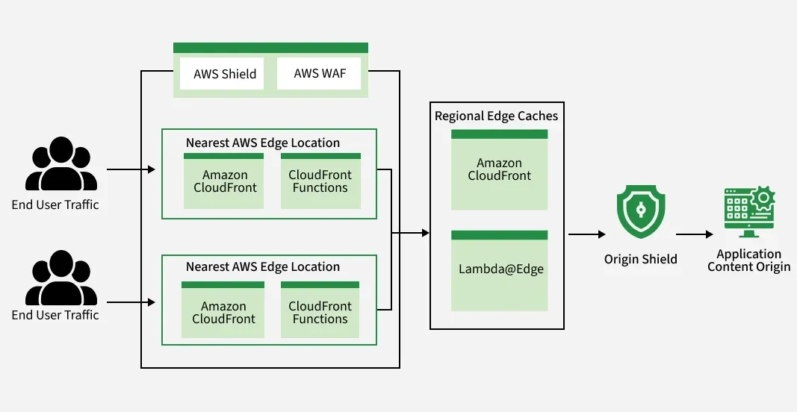

# overview
REF : https://www.geeksforgeeks.org/devops/aws-cloudfront/

AWS CloudFront is Amazon's high-performance Content Delivery Network (CDN) service. 

Think of it as a super-fast global delivery service for your website. It accelerates the delivery of your static and dynamic web content—such as images, videos, APIs, and applications—by caching copies of it in data centers (or "Edge Locations") around the world.

When a user visits your site, CloudFront delivers the content from the nearest edge location, dramatically reducing latency, speeding up load times, and improving the user experience.

REF : 

Benefits include : 
==================
1. Improved Website Performance: 
CDNs reduce latency by caching content at edge locations close to users, resulting in faster load times and a smoother browsing experience. 
This is crucial for maintaining user engagement and satisfaction.

2. Enhanced Reliability
CDNs distribute traffic across multiple servers, ensuring that even if one server goes down, others can handle the load. 
This redundancy enhances the availability and reliability of websites and online services.|

3. Scalability
CDNs can handle sudden spikes in traffic by distributing the load across their network. 
This scalability is essential for websites that experience variable traffic patterns, such as during product launches or viral content.

4. Security
CDNs offer protection against DDoS attacks, provide secure data transmission through SSL/TLS, and can include additional security features like web application firewalls (WAF) to safeguard content and user data.

5. Cost Efficiency
By offloading traffic from the origin server and reducing bandwidth consumption, CDNs can help lower infrastructure and operational costs. 
They also minimize the need for additional server capacity to handle peak loads.

Use Cases
==========
1. Static Website Hosting: Host your entire static site (HTML, CSS, JS) on S3 and serve it via CloudFront for fast performance, high availability, and low cost.

2. Video & Media Streaming: Deliver high-quality, on-demand, and live video streams globally with low latency.

3. API Acceleration: Cache responses from your APIs (e.g., on API Gateway or EC2) to reduce load on your backend and provide faster responses for common GET requests.

4. Software Distribution: Deliver software updates, patches, and downloads to users around the world quickly and reliably.

5. Security Perimeter: Use CloudFront with AWS WAF as the single "front door" to your application, filtering all malicious traffic at the edge.

# CloudFront Working: Core Concepts

To understand CloudFront, you need to know three key components:

1. Origin: 

- This is the "source of truth" for your content. 
- It's the server where the original version of your files is stored. 
- An origin can be an Amazon S3 bucket, an Elastic Load Balancer, an EC2 instance, or any custom HTTP/S server (even one on-premises).

2. Edge Location: 
- This is a data center in a global network, strategically located in major cities around the world (e.g., Tokyo, London, New York, Sydney). CloudFront has hundreds of these. 
- Edge Locations cache (store) copies of your content.

3. Distribution: 
- This is the core configuration that tells CloudFront how to deliver your content. 
- When you create a distribution, you specify your origin(s), set cache rules (like how long to store files), and configure security settings. 
- CloudFront gives you a unique domain name (e.g., d12345.cloudfront.net) for your distribution

# The Content Delivery Workflow

Here is the step-by-step process of how CloudFront delivers your content:

1. User Request: A user in London visits your website and their browser requests an image (e.g., logo.jpg).

2. DNS Routing: The request is routed by DNS to the nearest CloudFront Edge Location, which in this case is the London data center.

3. CloudFront Checks Cache: The London Edge Location checks its local cache for logo.jpg.

4. Cache Hit (Fast): If the file is in the cache (a "cache hit"), CloudFront immediately delivers it to the user. This is extremely fast.

5. Cache Miss (Slower): If the file is not in the cache (a "cache miss"), the Edge Location forwards the request back to your Origin server (e.g., your S3 bucket in the US).

4. Origin Response: The Origin server sends the logo.jpg file back to the Edge Location.

5. Cache & Deliver: The London Edge Location caches the new file (so the next user in London gets a cache hit) and then delivers it to the original user.

# Perfomance Enhancing Features of CloudFront
1. Global Edge Network: 
- With hundreds of Edge Locations and Regional Edge Caches (a "mid-tier" cache), CloudFront ensures your content is always physically close to your users.

2. Cache Invalidation: 
- By default, objects stay in the cache until their Time-To-Live (TTL) expires. 
- If you need to force an update now (e.g., you uploaded a new version of style.css), you can run an invalidation. 
- This tells CloudFront to "evict" the old file from all edge locations, forcing it to retrieve the new version from the origin on the next request.

3. Origin Groups for High Availability: 
- You can configure CloudFront with a primary origin (e.g., S3 bucket) and a secondary origin (e.g., another S3 bucket in a different region). 
- If the primary origin fails or returns an error, CloudFront automatically fails over and requests the content from the secondary origin.

# Security Features

1. AWS WAF & Shield Integration: 
- CloudFront integrates seamlessly with AWS WAF (Web Application Firewall) to protect your application at the edge from common exploits like SQL injection and XSS. 
- All distributions are also protected by AWS Shield Standard against DDoS attacks for free.

2. Origin Access Control (OAC): 
- This is the modern, secure way to connect CloudFront to an S3 origin. 
- OAC locks down your S3 bucket so that it only accepts connections from CloudFront, not the public internet. 
  This prevents users from bypassing the CDN and accessing your files directly, which saves on costs and enhances security.

3. Field-Level Encryption: 
- A powerful security feature that allows you to encrypt specific form fields (like a credit card number) at the edge before the request is forwarded to your origin. 
- This ensures sensitive data is never visible in plaintext to your backend application.

# Edge Computing: Lambda@Edge vs. CloudFront Functions

You can run custom logic at the edge to modify requests and responses before they hit your origin.

CloudFront Functions:
======================

- Best for: Lightweight, high-volume, low-latency tasks (e.g., cache-key manipulation, URL rewrites, HTTP header modifications).
- Speed: Runs in < 1ms.
- Language: JavaScript (ES 5.1).
- Cost: Extremely cheap, billed per-request.

Lambda@Edge:
=============

- Best for: More complex, compute-intensive tasks (e.g., advanced request authentication, image resizing on the fly, A/B testing logic).
- Speed: Can run for up to 30 seconds.
- Language: Node.js, Python.
- Cost: More expensive, billed per-request and duration (like regular Lambda).

# AWS CloudFront and Web Application Firewall (WAF)

Integration
============
AWS CloudFront, Amazon's Content Delivery Network (CDN), pairs seamlessly with AWS Web Application Firewall (WAF) to add an extra layer of security to your web applications. 

This combination helps protect your apps from common attacks like SQL injection and cross-site scripting by blocking harmful traffic at edge locations before it reaches your main servers.

AWS WAF
========
AWS WAF is a security service that acts as a barrier to protect your web applications from online threats. 

It blocks malicious traffic like SQL injections and cross-site scripting attacks, filtering requests that could harm your application. 

AWS WAF allows you to define custom security rules, so it can adapt to your specific needs and help keep your application secure.

CloudFront Working with WAF
============================
To integrate WAF with AWS CloudFront, you use Web ACLs (Access Control Lists). 
These ACLs are sets of rules that decide which traffic should be allowed and which should be blocked. 

When a user requests content, the request first reaches the nearest CloudFront edge location. 
The Web ACL checks whether the request meets the security rules and if it's legitimate, the request is forwarded to the origin server. If the request fails the security check, it gets blocked right at the edge, preventing bad traffic from ever hitting your server.

# Web ACL

A Web ACL is a list of security rules you set up to manage incoming traffic. You can create rules based on:

1. IP addresses: Block or allow traffic from specific IPs.
2. Request headers: Filter out requests based on header content.
3. Query strings and body content: Block malicious inputs like SQL injections.
4. Geographical locations: Limit access from certain regions.

# integration of AWS WAF with CloudFront
1. Better Security: The combination of CloudFront and WAF helps protect your application from malicious traffic before it reaches your origin servers.

2. Faster Performance: Since CloudFront caches content at edge locations, only safe traffic is passed to your origin, which reduces load and speeds up delivery.

3. Customizable Rules: Web ACLs let you set up rules based on your specific security needs.

4. Constant Protection: AWS WAF is always monitoring and updating security rules to protect against new threats.

