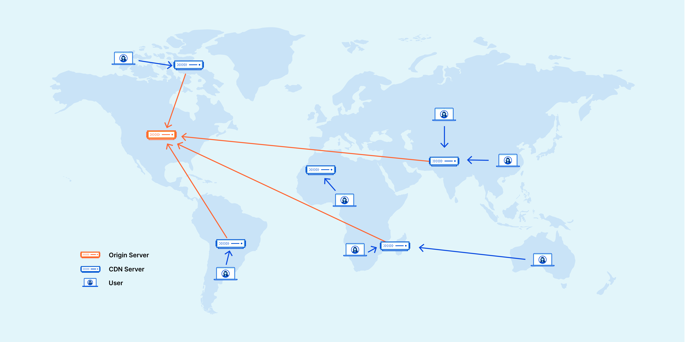

# REF
https://www.cloudflare.com/learning/cdn/what-is-a-cdn/

# What is a CDN?

Visitors are more inclined to click away from a slow-loading site, a CDN can reduce bounce rates and increase the amount of time that people spend on the site. In other words, a faster a website means more visitors will stay and stick around longer.

A content delivery network (CDN) is a geographically distributed group of servers that caches content close to end users. 

At its core, a CDN is a network of servers linked together with the goal of delivering content as quickly, cheaply, reliably, and securely as possible. In order to improve speed and connectivity, a CDN will place servers at the exchange points between different networks.

These Internet exchange points (IXPs) are the primary locations where different Internet providers connect in order to provide each other access to traffic originating on their different networks. By having a connection to these high speed and highly interconnected locations, a CDN provider is able to reduce costs and transit times in high speed data delivery.

Beyond placement of servers in IXPs, a CDN makes a number of optimizations on standard client/server data transfers. CDNs place Data Centers at strategic locations across the globe, enhance security, and are designed to survive various types of failures and Internet congestion.

REF : 

# So CDN replaces the web host?

- CDN does not replace the web hosting server, instead it does help in caching the content at the network edge.

- A web host stores your original files, while a CDN makes those files more accessible to a global audience by caching them.

- This edge caching helps in reducing latencies, reducing bandwidth consuption from the core to the edge etc.

# What are the benefits of using a CDN?
Although the benefits of using a CDN vary depending on the size and needs of an Internet property, the primary benefits for most users can be broken down into four different components:

1. Latency - Improving website load times 

- The globally distributed nature of a CDN means reduce distance between users and website resources. Instead of having to connect to wherever a website’s origin server may live, a CDN lets users connect to a geographically closer data center. Less travel time means faster service.

- Hardware and software optimizations such as efficient load balancing and solid-state hard drives can help data reach the user faster.

- CDNs can reduce the amount of data that’s transferred by reducing file sizes using tactics such as minification and file compression. Smaller file sizes mean quicker load times.

- CDNs can also speed up sites which use TLS/SSL certificates by optimizing connection reuse and enabling TLS false start.

2. Reliability and redundancy - Increasing content availability

- Uptime is a critical component for anyone with an Internet property. 

- Hardware failures and spikes in traffic, as a result of either malicious attacks or just a boost in popularity, have the potential to bring down a web server and prevent users from accessing a site or service. 

- A well-rounded CDN has several features that will minimize downtime:

a) Load balancing distributes network traffic evenly across several servers, making it easier to scale rapid boosts in traffic.

b) Intelligent failover provides uninterrupted service even if one or more of the CDN servers go offline due to hardware malfunction; the failover can redistribute the traffic to the other operational servers.

c) In the event that an entire data center is having technical issues, Anycast routing transfers the traffic to another available data center, ensuring that no users lose access to the website.

3. Reducing bandwidth costs 

- Bandwidth consumption costs for website hosting is a primary expense for websites. 

- Every time an origin server responds to a request, bandwidth is consumed.

- Through caching and other optimizations, CDNs are able to reduce the amount of data an origin server must provide, thus reducing hosting costs for website owners.

4. Improving website security 

- Information security is an integral part of a CDN. 

- A CDN may improve security by providing DDoS mitigation, improvements to security certificates, and other optimizations.

- A CDN can keep a site secured with fresh TLS/SSL certificates which will ensure a high standard of authentication, encryption, and integrity. Investigate the security concerns surrounding CDNs, and explore what can be done to securely deliver content. 

