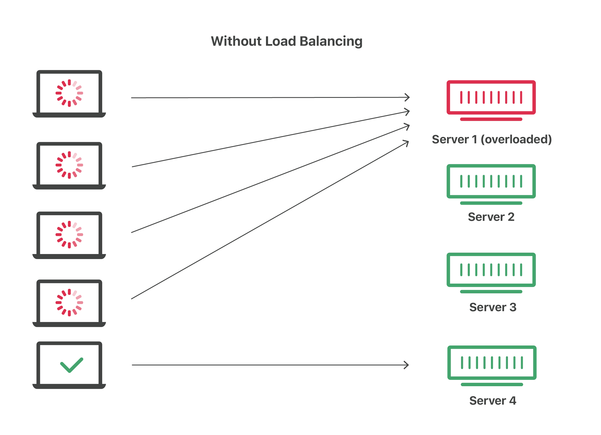
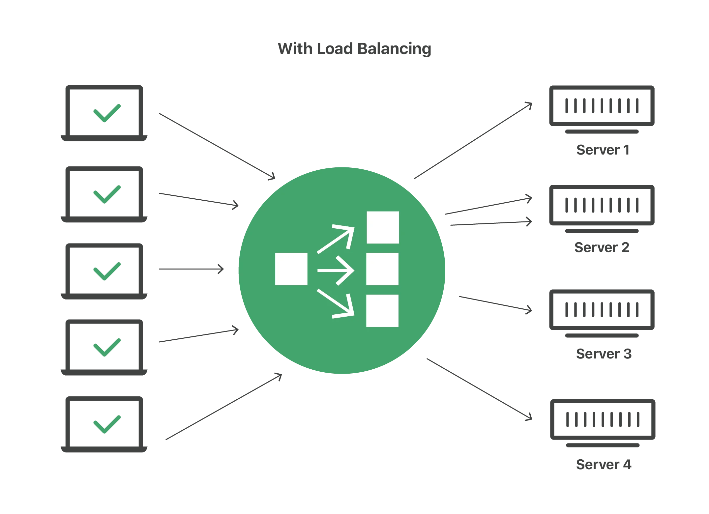

# REF 
https://www.digitalocean.com/community/tutorials/what-is-load-balancing
https://www.cloudflare.com/learning/performance/what-is-load-balancing/

# Overview

Load balancing is the practice of distributing network traffic or computational workloads across multiple servers to improve an application's performance and reliability.

A load balancer is a tool or application — either hardware-based or software-based — that distributes workloads and traffic among multiple servers.

Without a load balancer, the setup looks like : 

On the Internet, load balancing is often employed to divide network traffic among several servers. 

This reduces the strain on each server and makes the servers more efficient, speeding up performance and reducing latency. Load balancing is essential for most Internet applications to function properly.

REF : 

Typically, all the backend servers will apply identical content so that users reciever consistent content regardless of which server responds.

In the example illustrated above, the user accesses the load balancer, which forwards the user’s request to a backend server, which then responds directly to the user’s request. 

# Life example

Imagine a checkout line at a grocery store with 8 checkout lines, only one of which is open. All customers must get into the same line, and therefore it takes a long time for a customer to finish paying for their groceries. Now imagine that the store instead opens all 8 checkout lines. In this case, the wait time for customers is about 8 times shorter (depending on factors like how much food each customer is buying).

Load balancing essentially accomplishes the same thing. By dividing user requests among multiple servers, user wait time is vastly cut down. This results in a better user experience — the grocery store customers in the example above would probably look for a more efficient grocery store if they always experienced long wait times.

# How does load balancing work?

Load balancing is handled by a tool or application called a load balancer. 

A load balancer can be either hardware-based or software-based. 

Hardware load balancers require the installation of a dedicated load balancing device; software-based load balancers can run on a server, on a virtual machine, or in the cloud.

Content delivery networks (CDN) often include load balancing features.

When a request arrives from a user, the load balancer assigns the request to a given server, and this process repeats for each request. 

Load balancers determine which server should handle each request based on a number of different algorithms. These algorithms fall into two main categories: static and dynamic.

# What kind of traffic can load balancers handle?
Load balancer administrators create forwarding rules for four main types of traffic.

These forwarding rules will define the protocol and port on the load balancer itself and map them to the protocol and port the load balancer will use to route the traffic to on the backend.

1. HTTP

Standard HTTP balancing directs requests based on standard HTTP mechanisms. 
The Load Balancer sets the X-Forwarded-For, X-Forwarded-Proto, and X-Forwarded-Port headers to give the backends information about the original request.

2. HTTPS

HTTPS balancing functions the same as HTTP balancing, with the addition of encryption. 

Encryption is handled in one of two ways: 

a) SSL passthrough which maintains encryption all the way to the backend 

b) SSL termination which places the decryption burden on the load balancer but sends the traffic unencrypted to the back end.

3. TCP

For applications that do not use HTTP or HTTPS, TCP traffic can also be balanced. 

For example, traffic to a database cluster could be spread across all of the servers.

4. UDP

More recently, some load balancers have added support for load balancing core internet protocols like DNS and syslogd that use UDP.

