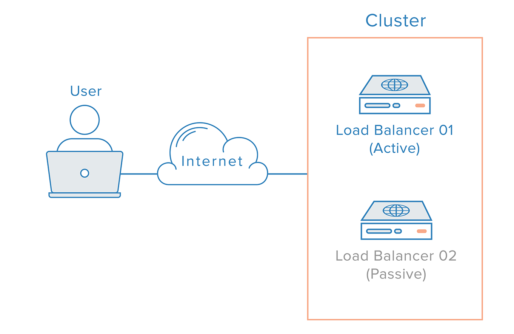

# Redundant Load Balancers
To remove the load balancer as a single point of failure, a second load balancer can be connected to the first to form a cluster, where each one monitors the others’ health. 

Each one is equally capable of failure detection and recovery.

REF : 

In the event the main load balancer fails, DNS must take users to the to the second load balancer. 

Because DNS changes can take a considerable amount of time to be propagated on the Internet and to make this failover automatic, many administrators will use systems that allow for flexible IP address remapping.

One system is the use of Floating IP Failover.

REF : 

# Floating IP Failover

Problem:

- DNS failover = slow (TTL, caching, propagation)
- You want instant failover when a load balancer dies

Solution:
- Use a floating virtual IP (VIP) that moves between devices

- This idea is mainly used On-prem

1. HSRP(Hot Standby Router Protocol)
=====================================

- one device is active and the other on standby. 
- The VIP moves if active fails.

Pros : a) Simple b) Predictable failover c) Fast(in seconds)

Cons : No load balancing. Only one is active.

Best for : 
- Active/Passive Load Balancers
- HA pairs (e.g. F5, HAProxy, NGINX)

Internet
   ↓
Floating VIP (HSRP)
   ↓
Active LB → Backend
Standby LB (idle)

2. GLBP(Gateway Load Balancing Protocol)
=========================================

- Multiple devices active simultaneously
- All share the same VIP
- Clients are distributed across devices

Pros : a) Built-in load balancing. b) Better resource usage.

Cons : a) More complex b) No deterministic failover behavior.

Best for:
- Multiple independent LBs
- Want horizontal scaling at Layer 3

But ⚠️:
- Most modern load balancing is done at Layer 7, not via GLBP
- GLBP is less common in cloud-native designs

# Modern cloud setup - Modern load balancing is mostly Layer 7 (application)

Cloud:

Azure → Front Door / Traffic Manager (DNS-based)
AWS → Elastic IP (sort of static, but not floating like HSRP)
Kubernetes → Service VIPs

Azure doesn’t use HSRP directly, but:
- Internal Load Balancer (ILB) = VIP abstraction
- Availability Sets / Zones = redundancy